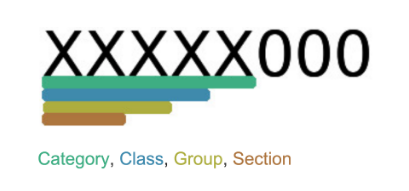
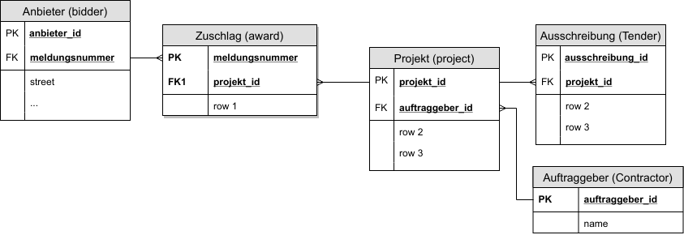
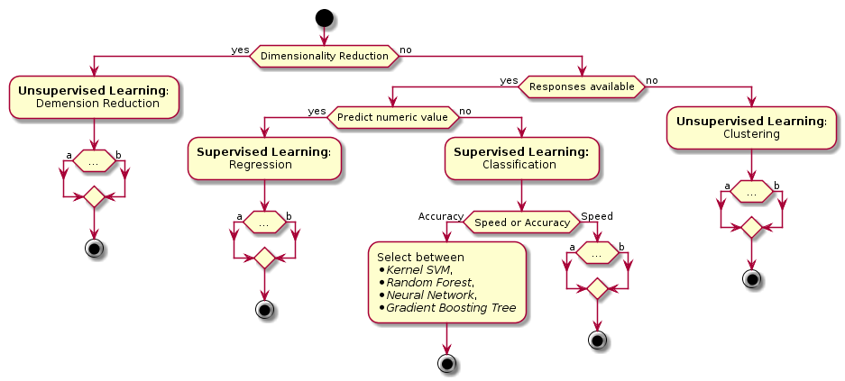
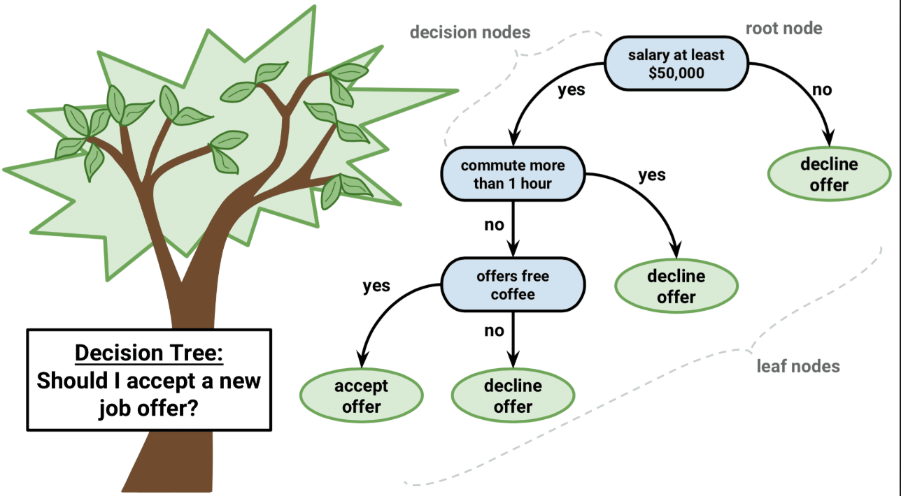
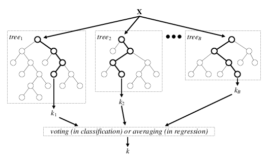

# Swiss Procurement

- \> 230’000 CHF public bidding
- <https://www.simap.ch> official web platform
- [FDN](http://www.digitale-nachhaltigkeit.unibe.ch) Simap Database:
    - Data Crawling by FDN
- <https://beschaffungsstatistik.ch>

[1](#lib-simap-database)

# Stats

| Name                  | avg. last 2 years |
|-----------------------|-------------------|
| invitations to tender | 9'000             |
| awards                | 7'500             |
| value of awards (CHF) | 14'000'000'000    |

[1](#lib-simap-database)

# CPV Code

- 45000000 - Bauarbeiten
    - 45300000 - Bauinstallationsarbeiten
        - 45310000 - Installateurarbeiten

# Problem description

illustrative example: <https://www.simap.ch>

# Aim

- Imitate and possibly improve the current process by automating it
- Use a data driven approach
- **Business value**: Reduce Effort, get better results

# Methodology & Tools

- Data as a base
- Specifiy a learning approach
- Agree on a machine learning algorithm
- Tools:
	- Python (Pandas, Numpy, Scikit Learn)
	- Jupyter Notebook

# Data presentation
FDN Simap Database

| Name        | no. of rows in DB |
|-------------|-------------------|
| tender      | 61'703            |
| awards      | 47'958            |
| bidder*     | 10'237            |
| contractor* | 2'794             |

\* unique: grouped by institution

[1](#lib-simap-database)

# Relations

# Machine learning
- "*Machine learning* is a method of data analysis that automates analytical model building." [2](#lib-ml)
- "[...] idea that systems can learn from data, identify patterns and make decisions with minimal human intervention." [2](#lib-ml)
- Supervised & Unsupervised Learning

# Situational Assessment

[1](#lib-simap-database)

# Algorithm Choice
- “No Free Lunch” theorem [3](#lib-nofreelunch)

[4](#lib-algo-map)

# Decision Tree

[5](#lib-decision-tree)

# Random Forest

[6](#lib-random-forest)

# Success Metrics
{width=600px}

[7](#lib-confusion)

# Model generation process

**iterative process ⭮**

1. select and prepare attributes
2. train model
3. model evaluation

# Current progress

[jupyter notebook](http://localhost:8888/notebooks/Test%20Suite.ipynb)

# 
 - To test:
 	- Tenders from similar domains
 	- Bidders with small set of positive responses

# Sources
<a name="lib-simap-database">1</a>: <http://beschaffungsstatistik.ch> [↩](#simap-database)

<a name="lib-ml">3</a>: <https://www.sas.com/en_us/insights/analytics/machine-learning.html> [↩](#ml)

<a name="lib-nofreelunch">4</a>: <https://elitedatascience.com/machine-learning-algorithms?imm_mid=0fa832&cmp=em-data-na-na-newsltr_20180117> [↩](#nofreelunch)

<a name="lib-algo-map">5</a>: <https://blogs.sas.com/content/subconsciousmusings/2017/04/12/machine-learning-algorithm-use> [↩](#algo-map)

<a name="lib-decision-tree">6</a>: <https://www.datacamp.com/community/tutorials/decision-trees-R> [↩](#decision-tree)

<a name="lib-random-forest">7</a>: <https://www.researchgate.net/figure/Architecture-of-the-random-forest-model_fig1_301638643> [↩](#random-forest)

<a name="lib-confusion">7</a>: <https://towardsdatascience.com/understanding-confusion-matrix-a9ad42dcfd62> [↩](#confiusion)

