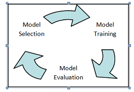

# Swiss Procurement (intro and problem description) -- Jan (2m)

- procurement example
- stats & facts (simap)
    - <https://www.simap.ch/shabforms/COMMON/application/applicationGrid.jsp?template=1&view=1&page=/MULTILANGUAGE/simap/content/start.jsp&language=EN>
    - <https://www.beschaffungsstatistik.ch/uebersicht/wichtige_informationen>
- shortcomings of the current process

# Problem description -- Jan (1m)

Um die Schwierigkeiten im aktuellen Beschaffungsprozess zu verstehen, beschreibe ich, wie ein fiktiver Anbieter interessante Ausschreibungen findet. Es fängt damit an, dass er auf die Webseite simap.ch und auf der linken Seite die folgende Navigation verwendet um einen ersten Eindruck zu gewinnen.
Öffnen des Links
Nach dem Wort Heizungsanlage suchen, danach CPV ganz grob eingrenzen und nochmals danach suchen.

# Aim -- Alex (1m)

- Imitate and possibly improve the current process by automating it
- Use a data driven approach
- **Business value**: Reduce Effort, get better results

# Methodology & Tools -- Alex (0.5m)

- Data as a base
- Specifiy a learning approach
- Agree on a machine learning algorithm
- Taking an iterative approach [1](#lib-data-analysis-steps)

- Tools:
	- Python (Pandas, Numpy, Scikit Learn
	- Jupyter Notebook

# Data presentation -- Jan (3m)

- fdn simap database (crawled database from simap)
- bidder, contractor, tender, award
- attributes:
    - cpv
    - zip
    - watt_gto
    ...

# Machine learning -- Alex (3m)

- "*Machine learning* is a method of data analysis that automates analytical model building." <sup">[2](#lib-ml)
- "[...] idea that systems can learn from data, identify patterns and make decisions with minimal human intervention." [2](#lib-ml)

| Supervised Learning | Unsupervised Learning    |
|---------------------|--------------------------|
| Regression          | Clustering               |
| Classification      | Dimensionality Reduction |

# ML – Situational Assessment

[3](#lib-simap-database)

# ML – Algorithm Choice
- “No Free Lunch” theorem [4](#lib-nofreelunch)

[5](#lib-algo-map)

# ML – Decision Tree

[6](#lib-decision-tree)

# ML – Random Forest

[7](#lib-random-forest)

# ML – Success Metrics
	- tn, tp, fn, fp
	- accuracy
	- cross validation
	- f1 score

# Model generation process -- Jan (5m)

**iterative process**

graphic for ...

1. select and prepare attributes
2. train model
3. model evaluation

# Current progress -- Alex & Jan ()

current attributes:
 - zip
 - cpv

 - To test:
 	- Tenders from similar domains
 	- Bidders with small set of positive responses

# Sources
<a name="lib-data-analysis-steps">1</a>: <http://www.dataperspective.info/2014/02/data-analysis-steps.html> [↩](#data-analysis-steps)

<a name="lib-simap-database">2</a>: <http://beschaffungsstatistik.ch> [↩](#simap-database)

<a name="lib-ml">3</a>: <https://www.sas.com/en_us/insights/analytics/machine-learning.html> [↩](#ml)

<a name="lib-nofreelunch">4</a>: <https://elitedatascience.com/machine-learning-algorithms?imm_mid=0fa832&cmp=em-data-na-na-newsltr_20180117> [↩](#nofreelunch)

<a name="lib-algo-map">5</a>: <https://blogs.sas.com/content/subconsciousmusings/2017/04/12/machine-learning-algorithm-use> [↩](#algo-map)

<a name="lib-decision-tree">6</a>: <https://www.datacamp.com/community/tutorials/decision-trees-R> [↩](#decision-tree)

<a name="lib-random-forest">7</a>: <https://www.researchgate.net/figure/Architecture-of-the-random-forest-model_fig1_301638643> [↩](#random-forest)

